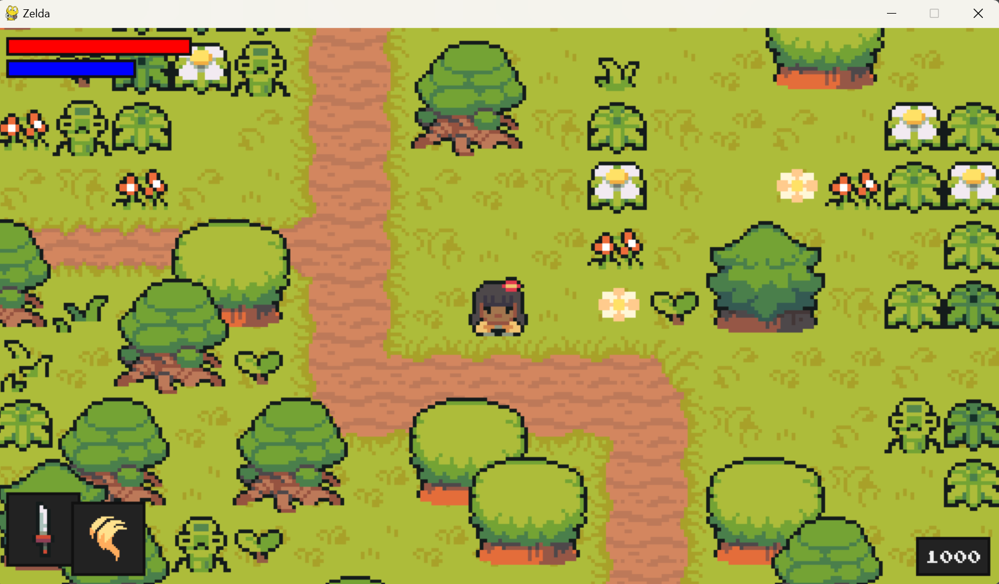
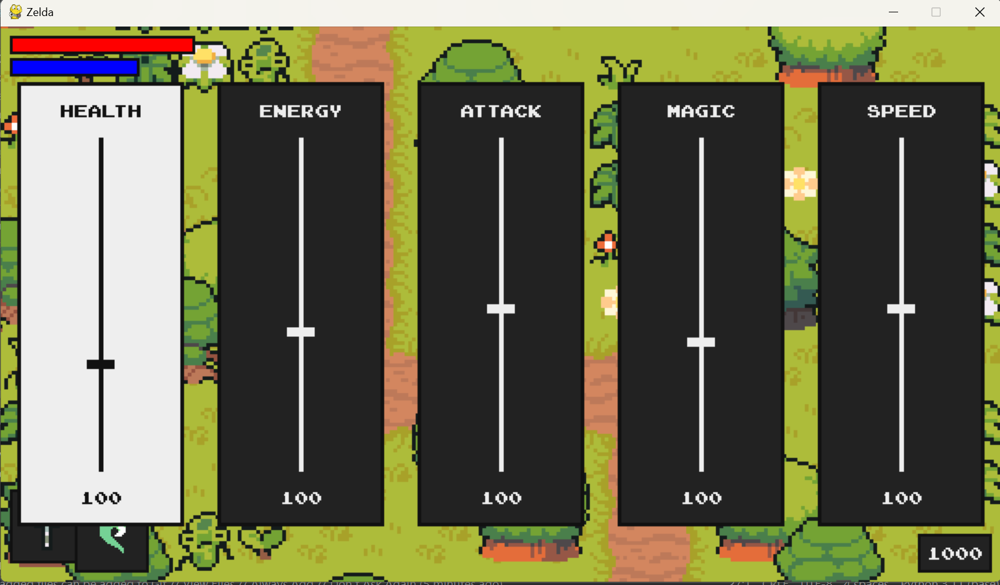
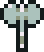

# Ninja Adventure

Welcome to the repository for "Ninja Adventure," the final project developed for EN.540.635 Software Carpentry FA2023.   

_Main game interface with character, HP/Energy, weapons, and EXP display._
## Collaborator
- Wen Zhang (KkkelseyWen): wzhan156@jh.edu

## Background
"Ninja Adventure" is a 2D action-adventure game inspired by the classic style of Zelda titles. It features charming pixel art and a retro soundtrack. The game focuses on exploration and combat, delivering an experience reminiscent of beloved classics while introducing its unique flair.

## Project Overview

### Required Module
- Pygame

### User Interface
The game boasts a user-friendly interface:
- Main Character: Positioned at the center of the screen for optimal gameplay experience.
- Health and Energy: Displayed on the top left, showing the ninja's current HP and energy levels.
- Weapons and Magic: Located on the bottom left, indicating the currently equipped weapon and magic.
- Experience Points: Shown on the bottom right. Earn EXP by defeating monsters to upgrade your ninja's abilities.

### Controls
- **Movement**: Arrow keys to move the ninja.
- **Attack**: Space key to attack monsters and grass.
- **Magic**: 
  - Left Shift to change magic effect.
  - Left Control to execute magic effect.
- **Weapons**: 
  - Right Control to change weapons.
  - Right Shift to switch to the upgrade UI.

### Upgrade Interface
- Use the Right and Left arrow keys to navigate through upgrade options.
- Press Space to select and apply an upgrade.

### Weapons
- **Sword**: The default weapon.
- **Axe**: Offers a balance between damage and cooldown time.
- **Lance**: Maximizes damage but has the longest cooldown.
- **Rapier**: Features the shortest cooldown with minimal damage.
- **Sai**: Provides a quick cooldown option with moderate damage.

### Magic Abilities
- **Heal**: Recovers 20 HP at the cost of 10 energy.
- **Flame**: Conjures a line of flames for a few seconds, attacking monsters at the cost of 20 energy.

### Monsters
- **Bamboo**: Forest dwellers.
- **Spirit**: Mysterious beings from the snowfields.
- **Squid**: Creatures from the ocean depths.
- **Raccoon**: The ultimate boss of the game.

### Screenshots

- **Upgrade UI**

_The upgrade user interface._   

- **Weapons**   
       
_Various weapons available in the game._   

- **Monsters**   

      
_The diverse range of monsters encountered in "Ninja Adventure."_

